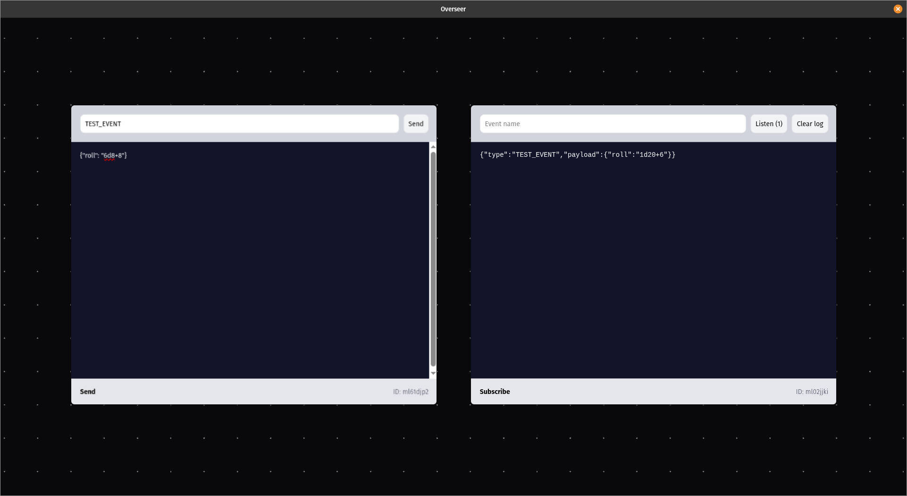

# Overseer debug plugin

Debug plugin for [Overseer Studio](https://overseer.studio).

## Installation

Copy the contents of this responsitory to a new folder in Overseer's data directory.

```shell
%APPDATA%\Roaming\Overseer Studio\Plugins\@overseer\debug

# Install dependencies
npm ci

# Build the assets
npm run build
```

Restart Overseer to load the plugin.

## Extensions

### Debug



## License

MIT © Infinite Turtles, LLC
